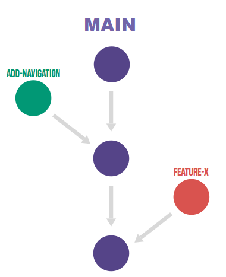

# Agenda
[The Case for Code Versioning](#the-case-for-code-versioning)

[Introducing GIT](#introducing-git)

[Getting GIT](getting-git)

[Getting a Repository](#getting-a-repository)

[Making and Saving Changes](#making-and-saving-changes)

[Ignoring Files](#ignoring-files)

[Sharing Changes](#sharing-changes)

[Content History](#content-history)

[Branch Management](#branch-management)

[Resolving Merge Conflicts](#resolving-conflicts)

[Undoing That Thing You Just Did](#undoing-your-work)

## The Case for Code Versioning
* Versioning Saves Snapshots Of Edited Code, With The Ability To Move Forward And Backward Along A History
  * Save Your Brilliant Idea For The Whole Team To Use
  * Undo That Unfortunate Choice
* The Timeline May Include Forks And Mergers Of Experiments Tried And Abandoned Or Propagated 
  * Try Three Things, Test Them In Parallel, And Keep The One You Like Best
  * Change Your Mind And Pick The Other Option That Was Almost As Fast, But Is More Flexible
* A Single Developer May Benefit From Code Versioning, But A Team Of Developers That Are Jointly Modifying A Project Is More Likely To Not Succeed Without Code Versioning 
  * That Elegant Algorithm Your Teammate Wrote Can't Be Used Until You Share Your Updated Data Prep Step
  * The Person Testing The Code You Shared Last Week Needs A Quick Fix, But You Are Halfway Through A New, Major Update
 

## Introducing GIT
* Global Information Tracker – Aka GIT 
* GIT Is A Utility/App/Program To Facilitate Managing Code Versions
* First Created In 2005 As Part Of Linux Development Environment
* Support Multiple Local Repositories That Can Be Conditionally Synchronized With Each Other
* Each Developer Can Have Their Own Copy Of Everything, And Can Share Updates With All, Or Some Of, The Other Developers As They Are Ready For Use

## Getting GIT
* Popular Toolset With Huge Web Presence
  * https://github.com/git-guides/install-git
  * https://git-scm.com/downloads
  * https://www.uvm.edu/news/story/git-version-control-system-uvm
    * https://gitlab.uvm.edu/

## Getting a Repository
* git clone
  * used to create a local copy of a remote repository
  * registers the remote repository as the origin of the copy
  * need to know the URL where the remote content is served from (i.e. our github area)
  * `git clone  git@github.com:scottebemeup/ciroh-ua_website.git`

* git pull
  * used to obtain the updates present at the remote origin
  * will merge new content into your current local working copy
  * `git pull`
  * `git pull origin main`

* git fetch
  * used to get content from a remote repository
  * does not merge content into your local working copy

## Resources

GIT Documentation - https://git-scm.com/docs
* https://git-scm.com/book/en/v2/Getting-Started-Git-Basics
* https://git-scm.com/book/en/v2/Git-Basics-Recording-Changes-to-the-Repository

https://dev.to/exwhyzed/how-to-git-a-complete-beginners-guide-1h85
https://dev.to/lydiahallie/cs-visualized-useful-git-commands-37p1  
https://dev.to/milu_franz/git-explained-the-basics-igc

Software Carpentry Version Control Lecture and Labs
https://swcarpentry.github.io/git-novice/

* Introduction to Version control
  * https://swcarpentry.github.io/git-novice/01-basics/
* Setting up GIT
  * https://swcarpentry.github.io/git-novice/02-setup/
* Collaboration using GIT
  * https://swcarpentry.github.io/git-novice/08-collab/
* Ignoring Files
  * https://swcarpentry.github.io/git-novice/06-ignore/
* Resolving Conflicts
  * https://swcarpentry.github.io/git-novice/09-conflict/
* History
  * https://swcarpentry.github.io/git-novice/05-history/

