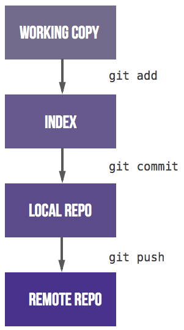

## Basic GIT Commands
* Git clone : To Create A Local Repository Connected To A Remote Copy 
  * Often Points To A Central Copy Referenced As The "Origin"
  * `git clone Git@gitlab.Uvm.Edu:vermont-epscor/Cyberinfrastructure.Git Cyberinf`
* Git status : To Assess The State Of A Local Repository 
  * List Any Untracked Files Or Tracked Files With Uncommitted Changes
* Git add : To Add A New Or Updated File To The List Of Updates To Be Tracked 
  * Adds A File To The List To Be Included In The Next Commit
* Git rm : To Stage The Removal Of Any Files For The Next Commit
* Git commit : To Formally Commit A Set Of Updates To A New Snapshot Of Content 
  * Bundle All Pending Added Changes Into A Retrievable Snapshot
* Git log: Display The History Of Updates Made To The Repository
* Git push : Share An Updated Local Repository To Update The Central Copy
* Git pull : Update A Local Repository With Updates From The Central Copy



## Making and Saving Changes

* They're "just" files. Change content as you always have


* `git status`  to list the files that have local changes
  * lists changes to be committed (staged)
  * lists changes not staged for commit
  * identifies new files (staged or unstaged)
  * lists tracked files that have been deleted

> #### Status of repository with staged new file and unstaged modification
> ```
> $ git status
> On branch master
> Your branch is up-to-date with 'origin/master'.
> Changes to be committed:
>   (use "git reset HEAD <file>..." to unstage)
> 
>     new file:   README
> 
> Changes not staged for commit:
>   (use "git add <file>..." to update what will be committed)
>   (use "git checkout -- <file>..." to discard changes in working directory)
> 
>     modified:   CONTRIBUTING.md
> ```


* git add - the simple use
  * `git add myfile.txt` to stage a single file
  * `git add myfile1.txt myfile2.txt` to stage a list of files
  * `git add myfile*.txt` to stage files using wildcarding
  * `git add .`  stages new and modified in the current directory and below, without deleted
  * `git add -u` stages modified and deleted, without new
  * `git add --all` to stage everything in all dirs that isn't already tracked or staged (CAUTION!)

* git add - much more subtlety and power lurks under many options 
    * `git add [--verbose | -v] [--dry-run | -n] [--force | -f] [--interactive | -i] [--patch | -p]
	  [--edit | -e] [--[no-]all | --[no-]ignore-removal | [--update | -u]]
	  [--intent-to-add | -N] [--refresh] [--ignore-errors] [--ignore-missing]
	  [--chmod=(+|-)x] [--] [<pathspec>…​]`
    * Note that file content is staged at the time of the `git add`
    * A file modified, staged, then re-modified, shows as staged and not staged

> #### Status with a staged modified file that has a 2nd modification
> ```
> $ git status
> On branch master
> Your branch is up-to-date with 'origin/master'.
> Changes to be committed:
>   (use "git reset HEAD <file>..." to unstage)
> 
>     new file:   README
>     modified:   CONTRIBUTING.md
> 
> Changes not staged for commit:
>   (use "git add <file>..." to update what will be committed)
>   (use "git checkout -- <file>..." to discard changes in working directory)
> 
>     modified:   CONTRIBUTING.md
> ```

* `git rm`  to stage the removal of any files for the next commit

* git commit
  * `git commit -m "meaningful message"`   commits all staged content to the local repository
  * `git commit -a -m "helpful description"`  automatically does an add for modified tracked files
  * `git commit --amend`   add staged information to the previous commit

## Ignoring Files
* sometimes there are files in a repository directory that we may not want git to process
  * files derived from source (*.o, *.pyc, *.jar)
  * files autosaved from editors (*.bak)
  * data files
  * output files
* Update contents of the file `.gitignore`
  * specify name patterns of files that git should ignore
      * *.pyc
      * *.[oa]
      * *.bak
  * specify directory names to exclude
      * datadir


## Sharing Changes
* git push 
  * `git push origin master`
  * `git push --dry-run`   will prepare the push, generate any messages, but make no changes
* git pull
  * Updates Your Local Repository Will All The Changes From The Remote Copy
* git rebase
	* Updates Your Local Branch With Updates From Parent Branch
	* Conflicts Merged Locally Prior To Any Push Of Of Your New Content 


## Content History
* git log
	* Scrollable History of All Commits to a Repository
* git tag
  * `git tag`   list of all defined tags
  * `git tag -l "partial*"`  list tags matching a wildcarded name
  * `git tag -a thetag -m "Good description"`  create a new annotated tag
  * `git tag -a goodtagname 9fceb02`   to tag a previous commit identifier
  * `git push origin --tags`   pushes all tags to the origin, alternatively they can be named
* git diff
	* Lists the Changes Between Current Committed Copy and Your Staging Area
* git show
  * `git show thetag`   list information about a tag
* git checkout
  * `git checkout thebranch`  to switch context to a branch
  * `git checkout thetag`   to switch context to a tagged commit (beware the HEADless context!)

## Branch Management
* git branch
  * `git branch`   list the current branches
  * `git branch testing` create a branch
* git checkout
  * `git checkout main`  selects main branch
  * `git checkout testing` selects testing branch
  * `git checkout -b newbranch` create and checkout a new branch
* currently selected branch pointed to by **HEAD**


## Resolving Conflicts
*  `git diff`
  * displays differences between two copies of content
*  `git merge`
  * attempts to reconcile differing content copies into a merged result
  * invoked under the covers of a `git pull`
* `git merge <branch_name>` merge updates made to "branch_name" to the current branch
* `git mergetool`  launches a graphical merge tool to guide the resolution of conflicts

## Undoing Your Work
* `git stash`  moves local edits to a side directory to avoid a merge conflict
* `git checkout` undoes unstaged edits
* git reset HEAD 
  * unstages a file
* git revert
  * undoes a commit
* `git merge --abort` undoes a merge conflict by by unspooling commits it made